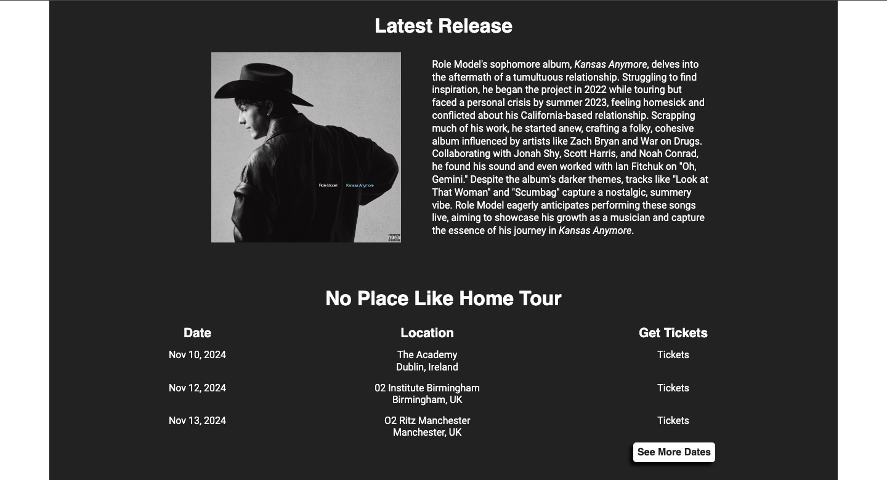
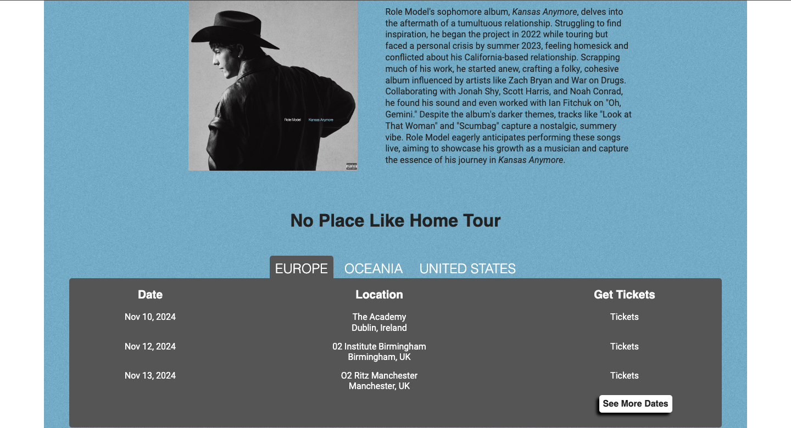
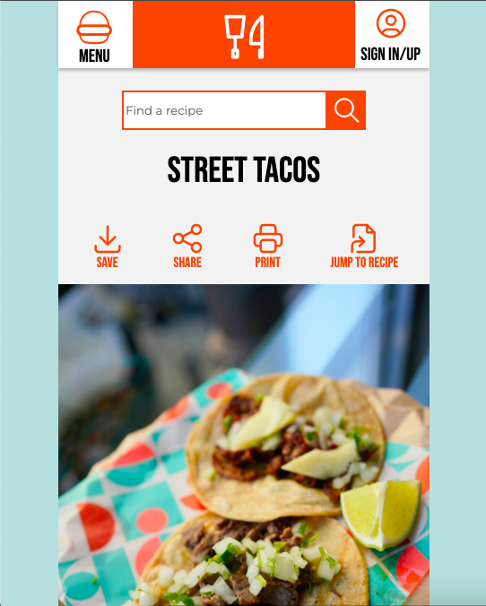
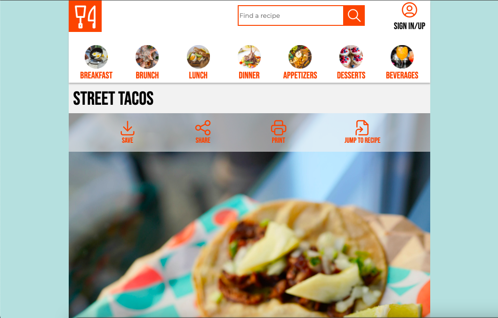

## Hi! 
I am a Human Systems Engineering student with a focus in User Experience. I am also a SCAP scholar and I will be continuing my education with ASU by pursuing a Master's degree in User Experience in the spring of 2026. In my time at ASU I have discovered a passion for web development. I have worked with HTML and CSS for over a year and started learning JavaScript over the past 6 months. I am particitpating in the Global Career Accelerator program where I will earn a certification in HTML & CSS and JavaScript & Web Development. I have experience using tools such as Webflow, Figma, and Balsamiq. Check out my pinned repositories to see what I've been working on!
- ✨ My Behance Profile: https://www.behance.net/jessicapiper2
- ✨ My CodePen Profile: https://codepen.io/jpiper5
- ✨ My LinkedIn Profile: www.linkedin.com/in/jessica-piper-5a041b2b0

## User Friendly Redesign

I was asked to create a single page website fixed at 1280px that included:
- Light/dark mode button
- Contact form
- Product display
- Game play

I decided to redesign a website for an artist named Role Model to make it more user friendly. The original website has a navigation that can be hard to read because of the font colors against the hero image. The tour section also includes each date of the tour, which requires users to scroll past all of them to get to the rest of the information on the home page. My redesign puts the navigation in a bar above the hero image so that it is always easy to read and the tour section shows the first three dates with an option to show more dates.
- My process: https://www.behance.net/gallery/210034949/git417final
- Link to repository: https://github.com/jpiper5/obfuscatedFinal

I was asked to create a single page website fixed at 1280px that included:
- jQuery widget/plugin
- Ajax/API content
- Web Storage
- Slideshow/carousel

I chose to update my website for Role Model to fit the requirements of this project. I kept the same user friendly elements for the navigation and tour section but added more functionality to follow the new guidelines. 
- My process: https://www.behance.net/gallery/214154963/GIT418-Final-Project
- Link to repository: https://github.com/jpiper5/418Obfuscated

## Responsive Design

The two websites above are fixed but I also have experience with creating responsive websites. This website shows a small, medium, and large viewport with a transition between breakpoints.
- Link to repository: https://github.com/jpiper5/recipe
